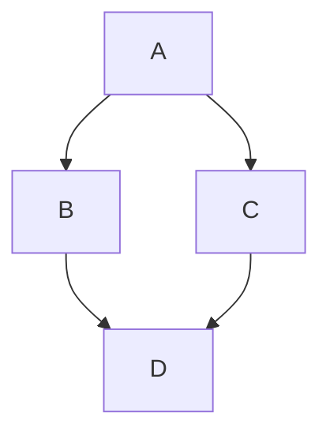

# Setup

This guide will walk you through setting up Gantha to create your first book website.

## Prerequisites

Before you begin, make sure you have:

- [Bun](https://bun.sh/) installed (recommended) or Node.js (v16 or higher)
- A text editor (VS Code, Vim, etc.)
- Basic knowledge of Markdown syntax

## Installation

1. **Clone or download Gantha**:
   ```bash
   git clone https://github.com/saturngod/gantha.git
   cd gantha
   ```

2. **Install dependencies**:
   ```bash
   bun install
   ```
   
   Or if using npm:
   ```bash
   npm install
   ```

## Project Setup

### Step 1: Add Your Content

Create your Markdown files in the `md/` folder. Each file represents a chapter or section of your book.

**Example structure**:
```
md/
├── introduction.md
├── chapter-1.md
├── chapter-2.md
├── chapter-3.md
└── conclusion.md
```

**Sample Markdown file** (`md/introduction.md`):
```markdown
# Introduction

Welcome to my book! This is the introduction chapter.

## Overview

This book covers...

## What You'll Learn

- Topic 1
- Topic 2
- Topic 3
```

### Step 2: Configure Table of Contents

Update `toc.json` to define your book structure. This file controls the navigation and chapter ordering.

**Example `toc.json`**:
```json
{
    "title": "My Awesome Book",
    "chapters": [
        {
            "id": "intro",
            "title": "Introduction",
            "subtitle": "Getting started with the book",
            "file": "introduction.md"
        },
        {
            "id": "chapter1",
            "title": "Chapter 1",
            "subtitle": "First concepts",
            "file": "chapter-1.md"
        },
        {
            "id": "chapter2",
            "title": "Chapter 2", 
            "subtitle": "Advanced topics",
            "file": "chapter-2.md"
        }
    ]
}
```

**Configuration options**:
- `title`: Your book's main title
- `id`: Unique identifier for each chapter (used for navigation)
- `title`: Chapter title displayed in navigation
- `subtitle`: Optional description shown under the title
- `file`: Markdown filename (relative to `md/` folder)

### Step 3: Build Your Website

Run the build command to generate your static website:

```bash
bun run build
```

Or with npm:
```bash
npm run build
```

The static HTML files will be generated in the `build/` folder.

### Step 4: View Your Book

Open `build/index.html` in your web browser to view your generated book website.

## Development Workflow

### Live Development

For development with file watching (automatically rebuilds when files change):

```bash
bun run dev
```

### Cleaning Build Files

To remove all generated files and start fresh:

```bash
bun run clean
```

## Customization

### Styling

- **Fonts**: Modify `template/styles/fonts.css` to change typography
- **Layout**: Edit `template/styles/styles.css` for layout customizations  
- **Colors**: Update CSS variables in the stylesheets

### Templates

The HTML template is located at `template/index.html`. You can modify this to change the overall page structure.

## Tips for Myanmar Content

When writing in Myanmar language:

1. Use Unicode Myanmar text in your Markdown files
2. The default fonts are optimized for Myanmar rendering
3. Consider using appropriate line heights for Myanmar text readability

## Troubleshooting

**Build fails**: 
- Check that all files referenced in `toc.json` exist in the `md/` folder
- Ensure file names match exactly (case-sensitive)

**Missing chapters**:
- Verify the `file` field in `toc.json` points to the correct Markdown file
- Check for typos in filenames

**Styling issues**:
- Clear browser cache and rebuild
- Check CSS syntax in custom stylesheets


## Mermaid Diagram

Supporting mermaid diagram from markdown.



## Next Steps

After setup, you can:

1. Add more content by creating new Markdown files
2. Customize the appearance by editing CSS files
3. Deploy your book to web hosting services
4. Share your generated website with readers

Static HTML files in the `build/` folder can be hosted on any web server or static hosting service like GitHub Pages, Netlify, or Vercel.